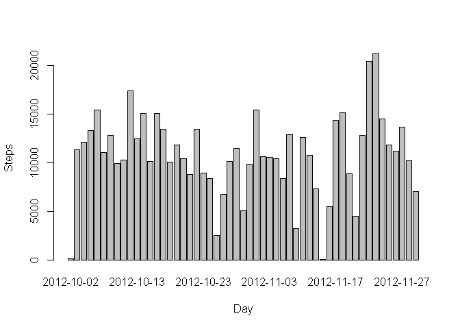
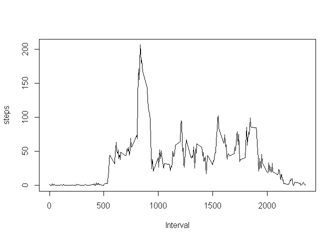
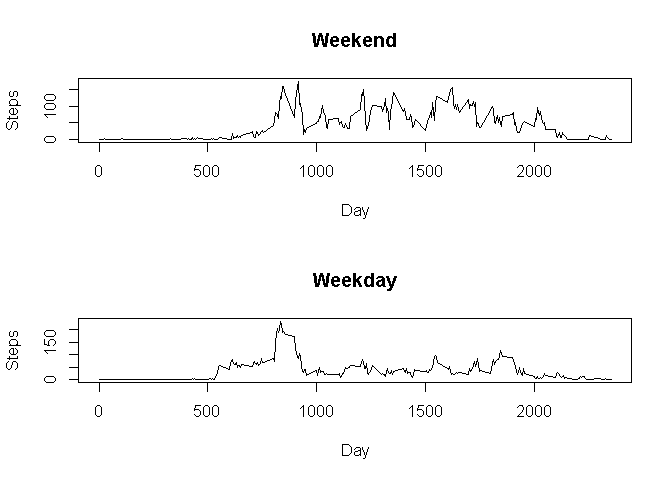

# Reproducible Research: Peer Assessment 1


## Loading and preprocessing the data


```r
if(!file.exists('activity.csv')){
    unzip('activity.zip')
}
activity <- read.csv("activity.csv")
```


## What is mean total number of steps taken per day?

```r
stepsDay <- aggregate(steps ~ date, data = activity, FUN = sum)
barplot(stepsDay$steps, names.arg = stepsDay$date, xlab = "Day", ylab = "Steps")
```

 

```r
mean(stepsDay$steps)
```

```
## [1] 10766.19
```

```r
median(stepsDay$steps)
```

```
## [1] 10765
```

## What is the average daily activity pattern?


```r
stepsInterval <- aggregate(steps ~ interval, data = activity, FUN = mean)
plot(stepsInterval, type = "l", xlab = "Interval", ylab="steps")
```

 

```r
stepsInterval$interval[which.max(stepsInterval$steps)]
```

```
## [1] 835
```

## Imputing missing values


```r
summary(activity$steps)
```

```
##    Min. 1st Qu.  Median    Mean 3rd Qu.    Max.    NA's 
##    0.00    0.00    0.00   37.38   12.00  806.00    2304
```

```r
activityI <- merge(activity, stepsInterval, by = "interval", suffixes = c("", ".y"))
na <- is.na(activityI$steps)
activityI$steps[na] <- activityI$steps.y[na]
activityI <- activityI[, c(1:3)]
mean(activityI$steps)
```

```
## [1] 37.3826
```

```r
median(activityI$steps)
```

```
## [1] 0
```

## Are there differences in activity patterns between weekdays and weekends?

```r
daytype <- function(date) {
    if (weekdays(as.Date(date)) %in% c("Saturday", "Sunday")) {
        "Weekend"
    } else {
        "Weekday"
    }
}
activity$daytype <- as.factor(sapply(activity$date, daytype))

par(mfrow = c(2, 1))
for (type in c("Weekend", "Weekday")) {
    steps.type <- aggregate(steps ~ interval, data = activity, subset = activity$daytype == 
        type, FUN = mean)
    plot(steps.type, type = "l", main = type,xlab = "Day", ylab = "Steps")
}
```

 
